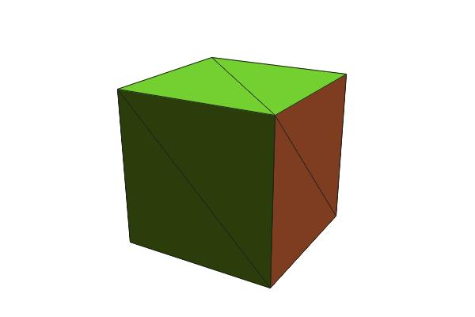

# glMatrix.php
A PHP port of the popular javascript glMatrix library. You can find the [original here](https://github.com/toji/gl-matrix) and [here](https://glmatrix.net).

## Install
```bash
composer require rasteiner/glmatrix.php
```

## Example

```php
<?php

use rasteiner\glMatrix\glMatrix;
use rasteiner\glMatrix\Mat4;
use rasteiner\glMatrix\Vec3;

require_once 'vendor/autoload.php';

// vertices for a 1x1x1 cube centered at the origin
$vertices = [
  [-0.5, -0.5, -0.5],
  [0.5, -0.5, -0.5],
  [0.5, 0.5, -0.5],
  [-0.5, 0.5, -0.5],
  [-0.5, -0.5, 0.5],
  [0.5, -0.5, 0.5],
  [0.5, 0.5, 0.5],
  [-0.5, 0.5, 0.5],
];

// indices for the 12 triangles that compose the cube
$indices = [
  [0, 1, 2],
  [0, 2, 3],
  [1, 5, 6],
  [1, 6, 2],
  [7, 4, 5],
  [6, 7, 5],
  [3, 0, 4],
  [7, 3, 4],
  [6, 2, 3],
  [7, 6, 3],
  [1, 5, 4],
  [0, 1, 4],
];

// create a new canvas
$width = 600;
$height = 400;
$canvas = imagecreatetruecolor($width, $height);
imageantialias($canvas, true);

// fill the canvas with a white background
$bgColor = imagecolorallocate($canvas, 255, 255, 255);
imagefill($canvas, 0, 0, $bgColor);


// create a new projection matrix
$projection = Mat4::create();
Mat4::perspective($projection, 45, $width / $height, 0.1, 100);

// create a new model view matrix
$eye = [0, 2, 5];
$center = [0, 0, 0];
$up = [0, -1, 0];
$modelView = Mat4::create();

Mat4::lookAt($modelView, $eye, $center, $up);
Mat4::scale($modelView, $modelView, [1.5, 1.5, 1.5]);
Mat4::rotateY($modelView, $modelView, glMatrix::toRadian(30));

// model view projection matrix
$mvp = Mat4::create();
Mat4::multiply($mvp, $projection, $modelView);

// transform the vertices
$transformedVertices = [];
foreach ($vertices as $vertex) {
  $transformedVertex = Vec3::create();
  Vec3::transformMat4($transformedVertex, $vertex, $mvp);
  $transformedVertices[] = $transformedVertex;
}

// sort the triangles by their z coordinate
usort($indices, function ($a, $b) use ($transformedVertices) {
  $z1 = ($transformedVertices[$a[0]][2] + $transformedVertices[$a[1]][2] + $transformedVertices[$a[2]][2]) / 3;
  $z2 = ($transformedVertices[$b[0]][2] + $transformedVertices[$b[1]][2] + $transformedVertices[$b[2]][2]) / 3;
  return $z2 <=> $z1;
});

$strokeColor = imagecolorallocate($canvas, 30, 30, 30);

foreach ($indices as $index) {
  $v1 = $transformedVertices[$index[0]];
  $v2 = $transformedVertices[$index[1]];
  $v3 = $transformedVertices[$index[2]];

  // get normals for the triangle
  $n1 = Vec3::create();
  $n2 = Vec3::create();
  $n3 = Vec3::create();
  Vec3::cross($n1, Vec3::subtract($n1, $v2, $v1), Vec3::subtract($n1, $v3, $v1));
  Vec3::cross($n2, Vec3::subtract($n2, $v3, $v2), Vec3::subtract($n2, $v1, $v2));
  Vec3::cross($n3, Vec3::subtract($n3, $v1, $v3), Vec3::subtract($n3, $v2, $v3));

  // get the average normal
  $n = Vec3::create();
  Vec3::add($n, $n, $n1);
  Vec3::add($n, $n, $n2);
  Vec3::add($n, $n, $n3);
  Vec3::normalize($n, $n);

  // dot product of the normal with the eye direction
  $dot = Vec3::dot($n, Vec3::normalize($n, Vec3::subtract($n, $eye, $center)));

  // calculate the color
  $color = round(255 * $dot);
  $color = max(0, min(255, $color));
  $fillColor = imagecolorallocate($canvas, $color, $color, $color);

  // perspective division
  $x1 = round(($v1[0] / $v1[2] + 0.5) * $width);
  $y1 = round(($v1[1] / $v1[2] + 0.5) * $height);
  $x2 = round(($v2[0] / $v2[2] + 0.5) * $width);
  $y2 = round(($v2[1] / $v2[2] + 0.5) * $height);
  $x3 = round(($v3[0] / $v3[2] + 0.5) * $width);
  $y3 = round(($v3[1] / $v3[2] + 0.5) * $height);

  // draw the triangle
  imagefilledpolygon($canvas, [$x1, $y1, $x2, $y2, $x3, $y3], $fillColor);

  // draw wireframe
  imageline($canvas, $x1, $y1, $x2, $y2, $strokeColor);
  imageline($canvas, $x2, $y2, $x3, $y3, $strokeColor);
  imageline($canvas, $x3, $y3, $x1, $y1, $strokeColor);
}

imagejpeg($canvas);
```

This script should produce the following image:

